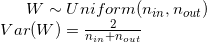
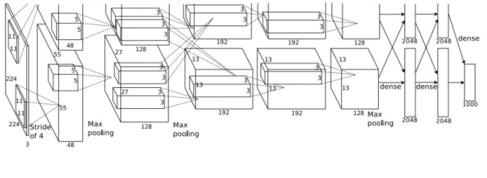
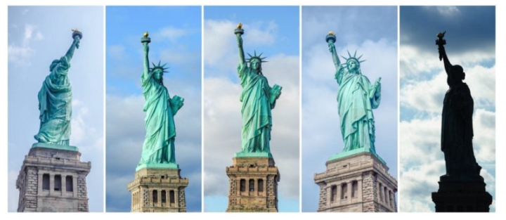
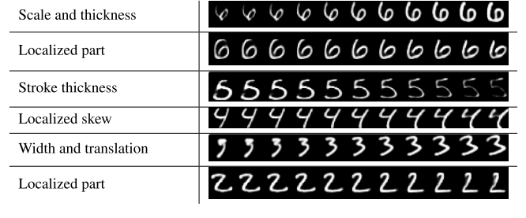
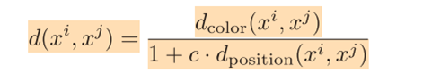

# PE Program Report - Image Lab 2018 Summer 
### Chung-Ang University, Undergraduate, Jinwoo Jeon
## Goals

This program is 
* To understand basic knowledges of Machine Learning and Neural Network.
* To make ability to read papers about Deep-Learning in now days.
* To research useful algorithms related to denoising.

## Research Plan (Checkpoints)

### 26/05/18
* Basic researches about machine learning
### 09/06/18
* Basic researches about deep-learning
### 23/06/18
* Basic researches about Object Recognition
### 07/07/18
* Basic researches about denoising
* Seminar about contemporary image processing
### 21/07/18
* Basic researches about denoising
* Seminar about contemporary image processing
### 04/08/18
* Seminar about contemporary image processing
* Prototype of denoising program using deep-learning methods
### 18/08/18
* Seminar about contemporary image processing
* Refinement of denoising program

***

# Daily Report

### 14th, May
### 1. To Create Tensor
To create a random matrix that has "dynamic" dimension, so called **tensor**, we can use rand function, which needs **two parameters**. 

And we assign this return value(matrix) to the variable.

<pre><code>import torch

randomMat = torch.rand(3,4)
</code></pre>

### 2. Various Functions
Generating tensor can be subdivided into several functions with various roles.

* torch.randn(a,b)
  * This method creates random matrix with normal distribution with size (a,b).
  
* torch.randperm(n)
  * This method creates random matrix with permutation of 0~n.

* torch.zeros(a,b)
  * This method creates matrix that is filled with 0s and size (a,b).
  
* torch.ones(a,b)
  * Same as zeros but filled with 1s.
  
* torch.arange(start, end, step=1)
  * Greater than or equal to start and less than end, step by step, makes a **list** of numbers. Default step is 1.
  
### 3. Data Types
Tensors are represented as a list of numbers enclosed in square brackets. 

* torch.FloatTensor(size | list)
  * This method creates float type tensor that has given size or list. 
* torch.LongTensor(size | list)
  * This method creates long type tensor that has given size of list. 
  
We can change Numpy to Tensor, vice versa.
* x2 = torch.from_numpy(x1) is for **numpu -> tensor**
* x3 = x2.numpy() is for **numpy <- tensor**

***

### 15th, May
### 1. Tensor Operations
Parameter dim means row when it is set to 0, column when it is set to 1. 

> This is not a correct sentence. "dim" means dimension of tensor since tensor is not just 2-D array.  

* Indexing
  * We can do indexing by torch.index_select(inputTensor, dim, index(may be list)) method.
  
* Masking
  * We can get masked tensor by torch.masked_select(inputTensor, mask(list)) method. This method returns masked tensor.
  
* Joining
  * We can concatenate two tensors by torch.cat([tns1, tns2],dim), If dim == 0, second one would be concatenated into row, otherwise, into column.
  
* Stacking
  * We can use stack of tensors by torch.stack(sequence, dim(=new dim)). This results an increase of dimension of tensor.
  
* Slicing
  * If you need a part of tensor, you can use torch.chunk(tensor, numOfChunks, dim). If dim = 0, tensor will be sliced by row, otherwise, to column.
  * Since result is multiple tensors, we can store each of them in different variables by positioning multiple variables to the left of the assignment.
  * **split()** method can do the same but its result is little bit different. We can think it as quotient and remainder.
  
* Squeezing
  * ` torch.squeeze(tensor) ` deletes dimesion whose size is **1**.
  * ` torch.unsqueeze(tensor, dim) ` adds dimension to "dim" dimension with size 1.
 
* Initializing
To use initialiing method, you should import torch.nn.init (e.g. as init)
  * ` init.uniform(tensor, a, b) ` fills tensor with values drawn from uniform distribution from a(lb) to b(ub).
  * ` init.normal(tensor, std) ` fills tensor with values drawn from normal distribution where standard deviation is std.
  * ` init.constant(tensor, val) ` fills tensor with constant(val).
  

### 2. Arithmetic Operation
You can add, multiply, divide tensors. Subtraction is proceeded by adding negative value or operator **-**.

Broadcasting(do the same thing to all elemnets) is supported.


* Addition is just as same as matrix addition.
* Multiplication and Division is performed element by element, not like matrix multiplication.
* If you want to do matrix multiplication, you should use torch.mm(tensor1, tensor2).

  
### 3. Matrix Operation
Matrix multiplication is not performed by star operator. To do that, you should use another method.
    x1 = torch.FloatTensor(3,4)
    x2 = torch.FloatTensor(4,5)
    torch.mm(x1,x2)

This torch.mm() method performs matrix multiplication which results 3 X 5 matrix

* Dot
  * You can do dot product by using ` torch.dot(x1, x2) `

* Transpose
  * You can transpose tensor by using ` (tensor obj).t() ` method

* Eigen Vector
  *  ` torch.eig(x1, True) `

* Eigen Value
  * ` torch.eig(x1, False) `
  
***

### 16th, May
### 1. Tensor? Variable?
Basically, tensor == variable. Variable is just a wrapper of tensor. Tensors are the actual data.

You can easily auto-compute the gradient of **variable**.

* Creator property
  * e.g.) You create a variable A, then add 1 to get B. Now there's a link stored between A and B, in the **creator** property.

Variable contains some variables in it. 
* data : wrapped tensor(actual data)
* grad : gradient of the variable
* requires_grad : for fine grained exclusion of subgraphs from gradient computation, increase efficiency. Only if all inputs don’t require gradient, the output also won’t require it. 
  * Backward computation is never performed in the subgraphs, where all Tensors didn’t require gradients.
* volatile : makes whole graph not requiring gradient.

### 2. Gradient Calculation
What is Gradient?
  * Gradient is a multi-variable generalization of the derivative. While a **derivative** can be defined on functions of a **single** variable, for functions of **several** variables, the gradient takes its place. 
  * The gradient is a vector-valued function, as opposed to a derivative, which is scalar-valued.
  * Gradient results vector from scalar.

To calculate gradient, you should import **Variable** module from **torch.autograd** 

```python
    import torch
    from torch.autograd import Variable
    x=Variable(torch.FloatTensor(3,4),requires_grad=True)
    y=x**2 + 4*x
    z=2*y + 3
    
    gradient = torch.FloatTensor(3,4)
    z.backward(gradient)
    
    print(x.grad)
    y.grad, z.grad
```
Since y is made of x, and z is made of y, when we need to find the gradient of z, we should differentiate y and x too by **chain rule**.

This code calculates the gradient of x. **backward** method accumulates gradients in the leaves - you might need to zero them before calling it.
    
***

### 17th, May
### 1. Linear Regression
Procedure : Gen data -> model -> optimize -> train -> check param

* Required Libraries
```python 
    import numpy as np 
    import torch
    import torch.nn as nn
    import torch.optim as optim
    import torch.nn.init as init
    from torch.autograd import Variable
```
* Generate Data
```python
    numOfData = 1000
    noise = init.normal(torch.FloatTensor(numOfData,1),std=0.2)
    x=init.uniform(torch.Tensor(numOfData,1),-10,10)
    y=2*x+3 #relation, the actual parameter values(answers; 2 and 3)
    y_noise = 2*(x+noise)+3 #same relation
```
* Model and Optimizer
```python
    model = nn.Linear(1,1) # bias is true (default), input size and ouput size of each sample is 1
    ouput = model(Variable(x)) # ouput 
    
    loss_func = nn.L1Loss() # Creates a criterion that measures the mean absolute value of the element-wise difference between input x and target y
    optimizer = optim.SGD(model.parameters(), lr=0.01) # stochastic gradient descent with learning rate = 0.01
```
* Train
```python
    loss_array = []
    lable = Variable(y_noise)
    num_epoch = 1000 # number of loop
    for i in range(num_epoch):
        ouput = model(Variable(x))
        optimizer.zero_grad()
        
        loss = loss_func(ouput,label)
        loss.backward()
        optimzer.step()
        if i%10 == 0: # print loss per 10 loops
            print(loss)
        loss_arr.append(loss.data.numpy()[0])
```
***

### 18th, May
### 1. Visdom
Visdom broadcasts visualizations of plots, images, and text for yourself and your collaborators.

`pip install visdom` to setup visdom, `python -m visdom.sever` to start server

#### Test Code
```python
    import numpy as np
    import torch
    import torch.nn as nn
    import torch.optim as optim
    import torch.nn.init as init
    from torch.autograd import Variable

    from visdom import Visdom
    viz = Visdom()

    num_data  = 1000
    num_epoch = 1000

    noise = init.normal(torch.FloatTensor(num_data,1),std=0.2)
    x = init.uniform(torch.Tensor(num_data,1),-10,10)
    y = 2*x+3
    y_noise = 2*(x+noise)+3

    input_data = torch.cat([x,y_noise],1)

    win=viz.scatter(
        X = input_data,
        opts=dict(
            xtickmin=-10,
            xtickmax=10,
            xtickstep=1,
            ytickmin=-20,
            ytickmax=20,
            ytickstep=1,
            markersymbol='dot',
            markersize=5,
            markercolor=np.random.randint(0, 255, num_data),
        ),
    )

    viz.updateTrace(
        X = x,
        Y = y,
        win=win,
    )

    model = nn.Linear(1,1)
    output = model(Variable(x))

    loss_func = nn.L1Loss()
    optimizer = optim.SGD(model.parameters(),lr=0.01)

    loss_arr =[]
    label = Variable(y_noise)
    for i in range(num_epoch):
        output = model(Variable(x))
        optimizer.zero_grad()

        loss = loss_func(output,label)
        loss.backward()
        optimizer.step()
        if i % 10 == 0:
            print(loss)
        loss_arr.append(loss.data.numpy()[0])

    param_list = list(model.parameters())
    print(param_list[0].data,param_list[1].data)

    win_2=viz.scatter(
        X = input_data,
        opts=dict(
            xtickmin=-10,
            xtickmax=10,
            xtickstep=1,
            ytickmin=-20,
            ytickmax=20,
            ytickstep=1,
            markersymbol='dot',
            markercolor=np.random.randint(0, 255, num_data),
            markersize=5,
        ),
    )

    viz.updateTrace(
        X = x,
        Y = output.data,
        win = win_2,
        opts=dict(
            xtickmin=-15,
            xtickmax=10,
            xtickstep=1,
            ytickmin=-300,
            ytickmax=200,
            ytickstep=1,
            markersymbol='dot',
        ),
    )

    x = np.reshape([i for i in range(num_epoch)],newshape=[num_epoch,1])
    loss_data = np.reshape(loss_arr,newshape=[num_epoch,1])

    win2=viz.line(
        X = x,
        Y = loss_data,
        opts=dict(
            xtickmin=0,
            xtickmax=num_epoch,
            xtickstep=1,
            ytickmin=0,
            ytickmax=20,
            ytickstep=1,
            markercolor=np.random.randint(0, 255, num_epoch),
        ),
    )
```


***

### 21st, May
### 1. CNN
#### What is CNN ? 
* CNN is abbreviation of Convolutional-Neural-Network. 
* Convolution : Combine two data into one datum.
* Neural Network : Such systems "learn" (i.e. progressively improve performance on) tasks by considering examples, generally without task-specific programming.
* Input image and Convolution kernel makes Featured image. 
* The point is that CNN makes this convolution kernel itself. Kernel does not have fixed values. Rather, its values are modified by conv net.
  
#### Test Code
```python
    import torch
    import torch.nn as nn
    import torch.utils as utils
    from torch.autograd import Variable
    import torchvision.datasets as dset
    import torchvision.transforms as transforms
    import matplotlib.pyplot as plt
    %matplotlib inline


    # Set Hyperparameters

    epoch = 100
    batch_size =16
    learning_rate = 0.001


    # Download Data

    mnist_train = dset.MNIST("./", train=True, transform=transforms.ToTensor(), target_transform=None, download=True)
    mnist_test  = dset.MNIST("./", train=False, transform=transforms.ToTensor(), target_transform=None, download=True)
    
    
    # Check the datasets downloaded

   print(mnist_train.__len__())
    print(mnist_test.__len__())
    img1,label1 = mnist_train.__getitem__(0)
    img2,label2 = mnist_test.__getitem__(0)

    print(img1.size(), label1)
    print(img2.size(), label2)


    # Set Data Loader(input pipeline)

    train_loader = torch.utils.data.DataLoader(dataset=mnist_train,batch_size=batch_size,shuffle=True)
    test_loader = torch.utils.data.DataLoader(dataset=mnist_test,batch_size=batch_size,shuffle=True)
    
    
    # torch.nn.Conv2d(in_channels, out_channels, kernel_size, stride=1, 
    #                 padding=0, dilation=1, groups=1, bias=True)
    # torch.nn.MaxPool2d(kernel_size, stride=None, padding=0, dilation=1,
    #                    return_indices=False, ceil_mode=False)
    # torch.nn.BatchNorm2d(num_features, eps=1e-05, momentum=0.1,affine=True)
    # torch.nn.ReLU()
    # tensor.view(newshape)

    class CNN(nn.Module):
        def __init__(self):
            super(CNN,self).__init__()
            self.layer1 = nn.Sequential(
                            nn.Conv2d(1,16,5),   # batch x 16 x 24 x 24
                            nn.ReLU(),
                            nn.BatchNorm2d(16),
                            nn.Conv2d(16,32,5),  # batch x 32 x 20 x 20
                            nn.ReLU(),
                            nn.BatchNorm2d(32),
                            nn.MaxPool2d(2,2)   # batch x 32 x 10 x 10
            )
            self.layer2 = nn.Sequential(
                            nn.Conv2d(32,64,5),  # batch x 64 x 6 x 6
                            nn.ReLU(),
                            nn.BatchNorm2d(64),
                            nn.Conv2d(64,128,5),  # batch x 128 x 2 x 2
                            nn.ReLU()
            )
            self.fc = nn.Linear(2*2*128,10)

        def forward(self,x):
            out = self.layer1(x)
            out = self.layer2(out)
            out = out.view(batch_size, -1)
            out = self.fc(out)
            return out

    cnn = CNN()

    loss_func = nn.CrossEntropyLoss()
    optimizer = torch.optim.Adam(cnn.parameters(), lr=learning_rate)
    
    
    # Train Model with train data
    # In order to use GPU you need to move all Variables and model by Module.cuda()

    for i in range(epoch):
        for j,[image,label] in enumerate(train_loader):
            image = Variable(image)
            label = Variable(label)

            optimizer.zero_grad()
            result = cnn.forward(image)
            loss = loss_func(result,label)
            loss.backward()
            optimizer.step()

            if j % 100 == 0:
                print(loss)
              
              
    # Test with test data
    # In order test, we need to change model mode to .eval()
    # and get the highest score label for accuracy

    cnn.eval()
    correct = 0
    total = 0

    for image,label in test_loader:
        image = Variable(image)
        result = cnn(image)

        _,pred = torch.max(result.data,1)

        total += label.size(0)
        correct += (pred == label).sum()

    print("Accuracy of Test Data: {}".format(correct/total))
```
***
### 22nd, May
### CNN
#### Analysis of CNN 

CNN is made up of several layers. There are three layers in addition to the layers for classification: convolutional layer, relu layer, and pooling layer.

**First**, the convolutional layer is the part that scans the image, simply repeating multiplication and addition. The kernel used at this time is called the convolution kernel. Multiply the value of the corresponding kernel element for each pixel, and add all of them to the value of the target pixel. This will result in a `d * d` matrix for the `d * d` input.


**Second**, the ReLU layer proceeds according to the following definition. `ReLU (x) = max (0, x)` That is, keeps its value for positive numbers and makes negative numbers zero.

**Third**, the pooling layer summarizes the `d * d` input as `k * k`. Where `d > k`. As a representative pooling method, max pooling is used to summarize the largest value of the input data.

After passing through these three layers, the input image can be said to pass through one filter. Pixel values ​​were modified by the kernel and reduced in size from `d * d` to `k * k`. This is called **convolve**.


Now, if there are N of these filters, scan N times, relu application N times, and pooling N times, resulting in N results. But this is only half of CNN's role. CNN's ultimate goal is to extract the right features from the image. Therefore, in order **to extract the feature**, the **classification of the input image should proceed first**.


This is done at the Fully Connected Layer. The N (assumed to be feature) outputs obtained in the previous process are classified by passing through MLP. Then modify the values of the convolution kernel based on the output layer results.
Yes. The initial values of the convolution kernel are initially specified **randomly**. And, by learning map, we find the values necessary for classification by oneself. A person does not need to set a price in advance.

Let's say we have a photo of the dog, a label of Dog, a picture of the cat, and a label of Cat. After learning these pictures, if you give them the first picture of the dog that is not in the learning set, CNN can classify it as Dog.

***

### 23rd, May
### 1. Machine Learning Algorithms
#### How Machine Learns?


The learning algorithm of machine learning is largely divided into supervised learning and unsupervised learning.

It can be divided into Deep or Shallow according to the number of layers. Ranzato classifies a number of learning algorithms as follows.


Learning algorithms generally include 'reinforcement learning' in addition to the two 'supervised learning' and 'unsupervised learning'.


### 2. Supervised Learning

Supervised learning is a way of learning that knowing the answer of given input. It is a method to make a model based on the data with the learning data and the correct label for it and to estimate the data of the new verification set.

To get the right learning outcomes, lots of learning data that has good quality should be prepared. Nowadays, because there is a database like ImageNet, it is easy to get data for learning, but it is rare that it contains the correct answer, so the painful process must be preceded by giving expectations one by one. 

Typically, pattern recognition belongs to supervised learning.


### 3. Unsupervised Learning


Unsupervised learning is a learning method in which a student finds patterns or features in data through algorithms.

Although it can be thought that it is convenient to learn by itself if we put only learning data, it is difficult to implement, and in the process of inferring the criterion for the feature itself, it is possible to return different result than expected. 

Typically, data mining belongs to unsupervised learning.


### 4. Reinforcement Learning

Reinforcement learning is an algorithm that rewards and punishes as if training a pet. 

This can be used when the relationship between input and output can not be clearly described, as opposed to superviesed learning. This method is effective when the number of cases is too large to judge right or wrong. 

For example, the AlphaGo is famous for its confrontation with Lee Sedol in Korea. 

These features can be useful for real-life problems, which are suitable for autonomous driving or strategic simulation problems.

***
### 24th, May
### 1. Softmax Classification
#### Multinomial classification


The multinomial classification is a classification that classifies the most probable class in several labels. There is nothing special about multinomial, but it's all about doing binary classification many times like an if statement in programming and calculating the probability that belongs to each class accordingly.

In the ordinary expression `Wx + b`, W was `1 * N`. For multiple binary classifications, you can write W in `K * N`.
Where N is the number of elements in the input vector and K is the number of classes to classify. For example, if W is 3 * 3, then three classes are distinguished and the input vector will be given as 3 * 1.


The result of Wx + b is hatched to y. This value is the predicted value, not the probability value yet. Adjust this value between 0 and 1 using the sigmoid function. After that, one-hot encoding is done through the arg max function to clearly indicate which one to select.

The cost function is obtained by using the probability value obtained in the previous step and the one-hot encoding value. The log function is used and the `-log(S(Yi))` value of the probability value of the class selected by one-hot encoding is used as cost.

Finally, the gradient decent method is used to find the minimum value and the learning proceeds. This part is too complicated, so it only understands the function call.

***


### 25th, May
### 1. AutoEncoder
#### What is AutoEncoder?


The structure is similar to that of MLP, but their purpose is quite different.
MLP aims to classify the input vector into one of the given classes, but AE aims to approximate the output to the input.

AE is a kind of compression because the number of neurons in the hidden layer is generally smaller than that of the input layer. Also, since the output layer must be equal in number to the input layer and the number of neurons, decoding is performed from the hidden layer to the output layer.

When using AE to extract information from an input vector, if the number of neurons in the hidden layer is larger than the number of neurons in the input layer, the weight of AE is simply calculated immediately. If we make the weight of the remaining neurons zero, it is over. Therefore, the number of neurons in the hidden layer must be smaller than the number of neurons in the input layer. Putting a number of constraints on it gives you an excellent ability to reduce dimensions.


Hidden layers can be multiple layers like MLP. Therefore, AE usually has an hourglass shaped graph. As the bottleneck reaches the hidden layer, AE can express the features from the front more compactly.

***


### 28th, May
### 1. Basics of Deep-learning
#### 5-steps of learning

* Choose Proper Network

* Check Gradient 

* Parameter Initialization

* Parameter Optimization

* Prevent Overfitting


#### Choose Proper Network - non-linearity

To choose network, we should know the structures of each networks and method about acquiring non-linearity. 

Structures of networks will be handled in July.

Before that, we should know how to acquire non-linearity.

#### What is Non-linearity?

By using a linear function as an activation function, when the layer is stacked, the network can be expressed again as a single equation. This is no different from working without a hidden layer.

In this way, only very simple problems can be solved. classification is rarely divisible by a straight line. Therefore, performance is very bad when using linear functions. It is therefore essential to use non-linear functions.

Non-linear functions include the sigmoid function and the tanh function. The s-shaped function represents a value between 0 and 1 or -1 and 1.

### 2. Non-linearity Functions
#### Sigmoid

Sigmoid function is also called as logistic function. The equation is like this:

=\frac&space;{&space;1&space;}{&space;1&plus;{&space;e&space;}^{&space;-x&space;}&space;})


We usually set threshold as 0.5, which means the neuron will be activated when `x > 0`.

But this function has a disadvantage that is fatal to Deep-Neural-Network. The graph that differentiates sigmoid function is as follows.

&space;=\sigma&space;(x)(1-\sigma&space;(x)))


As you can see, when input value is greater than 5 or less than -5, the result become very close to 0. And also, gradient of this function is always greater than 0.

#### Hyperbolic tangent

As mentioned above, the gradient of sigmoid function is positive for all integers. This slows down the speed of learning or makes it impossible to learn. 


In process of back propagation, if we differentitate Loss for every w_i, all gradients are positive or all negative since every input is postive because of sigmoid function.

This phenomenon is lead to a problem shown below, which is slowing down the learning speed.


If we say blue arrow is an optimal way, network only can reach optimal point by zigzag way(red arrows).

Therefore, we decided to use a new activation function that is hyperbolic tangent. The equation is like this:


The function has same shape of sigmoid, but it is scaled and shifted. We can see that function is symmetric with respect to zero, unlike the sigmoid function. 


But this function has same problem that sigmoid has; The Gradient Vanishing Problem.


### 3. Problems
#### Gradient Vanishing/Exploding Problem

As the neural network becomes deeper and deeper, it faces the **Gradient Vanishing / Exploding Problem**. It is a phenomenon that, in the process of optimizing through the derivative using the SGD(Stochatstic Gradient Descent) method, when the input value is out of a certain range, the slope becomes close to 0, and as it passes through the hidden layers, it gradually converges to zero, that makes network can't learn as result can't affect parameters. This led a deep, cold winter of Neural Network for 20 years(1986~2006).


So we use the function which is called ReLU or function called Maxout to solve this problem.
The use of ReLU solves the problem, but at the same time it is easier to differentiate and reduce computational complexity. Compared to sigmoid, ReLU converges about 6 times faster.

### 4. Solution
#### ReLU(Rectified Linear Unit)

Rectified Linear Unit is first invented by Geoffrey Hinton in 2006. He pointed that we used wrong type of non-linearity and suggested ReLU as solution. It's equation is like this:

f(x)=max(0,x)


This simple function solved gradient vanishing problem by making it's gradient as 1 for all positive x. It is easier than sigmoid or hyperbolic tangent to differentiate. This made NNs learn faster than before. 


### 5. Next Step
#### Parameter Initialization

What happens if we initialize all the weights of the network to zero? Whatever the input is, if the weight is zero, then the same value is passed to the next layer as `k * 0 = 0` for all k.
If all nodes have the same value when back propagation, the weights are all updated equally. That is, even if the number of neurons is increased for hidden layers, the expression power of the network is limited.

Therefore, an initialization methodology emerges.

***

### 29th, May
### 1. Parameters
#### Parameter Initialization

To set initial values of the weights and bias of each layer are very important. Since the problems we try to solve by neural network are optimization problems in non-convex condition, it may not be possible to find the optimum point if the starting point is mis-caught. (networks stops at local minima)


If the initial value of the parameter is set appropriately, it is effective also for gradient adjustment. If we initialize the weight vector W of the input layer to all 0s, the weight is zero at the first forward propagation, so the same value is transmitted to the second layer (bias value). In other words, the neural network can not operate properly because the same value is transmitted to all nodes.

In 2006, Professor Geoffrey Hinton realized that there was a problem with the parameter initialization method at the time of "A Fast Learning Algorithm for Deep Belief Nets" and proposed a new method called Restricted Boltzmann Machine. This paper introduces the concept of "pre-train".

#### Restricted Bolzmann Machine(Hinton et al. 2006)


Weights are forwarded to the next layer for the value of x in the current layer(**forward**). This time, we pass backwards the value to the previous layer and weave it backward(**backward**). By doing this **forward** and **backward** repeatedly, we can find the weight that minimizes the difference between the first input x and the predicted x value x_hat .

Applying this between every layer will properly initialize the weights between all layers. This pre-trained (or fine-tuned) network does not take a long time for learning. Although we benefited from this learning speed, the RBM is difficult to implement because of its complicated structure. A paper published in 2010 suggests that similar results can be achieved without this complex initialization.

### 2. Better Initialization
#### Xavier/He Initialization (Glorot and Bengio, 2010) (He,Zhang, Ren and Sun, 2015)

The xavier initialization released in 2010 is incredibly simple, but at the same time it shows incredibly good performance. Xavier initialization selects a random number between the input and output values and divides it by the square root of the input value.

#### Xavier Initialization (LeCun Initialization)


#### Glorot Initialization



He initialization which applied xavier initialization, uses the square root of the input value divided by half to generate a wider range of random numbers than the xavier.

#### He Initialization


Here is the code :

```python
#xavier initialization
W = np.random.randn(fan_in, fan_out)/np.sqrt(fan_in)

#He initialization
W = np.random.randn(fan_in, fan_out)/np.sqrt(fan_in/2)
```

***

### 30th, May
### Pretrained Models
#### Using ResNet50 by Pytorch 

```python
# How to use Pretrained models with PyTorch
# Simple Classifier using resnet50

import torch
import torch.nn as nn
import torch.optim as optim
import torch.utils.data as data
import torchvision.models as models
import torchvision.datasets as dset
import torchvision.transforms as transforms
from torch.autograd import Variable

batch_size = 3
learning_rate =0.0002
epoch = 50

resnet = models.resnet50(pretrained=True)

# Input pipeline from a folder containing multiple folders of images
# we can check the classes, class_to_idx, and filename with idx

img_dir = "./images"
img_data = dset.ImageFolder(img_dir, transforms.Compose([
            transforms.RandomSizedCrop(224),
            transforms.RandomHorizontalFlip(),
            transforms.ToTensor(),
            ]))

print(img_data.classes)
print(img_data.class_to_idx)
print(img_data.imgs)

# After we get the list of images, we can turn the list into batches of images
# with torch.utils.data.DataLoader()

img_batch = data.DataLoader(img_data, batch_size=batch_size,
                            shuffle=True, num_workers=2)

for img,label in img_batch:
    print(img.size())
    print(label)

# test of the result coming from resnet model

img = Variable(img)
print(resnet(img))

# we have 2 categorical variables so 1000 -> 500 -> 2
# test the whole process

model = nn.Sequential(
            nn.Linear(1000,500),
            nn.ReLU(),
            nn.BatchNorm1d(500),
            nn.Linear(500,2),
            nn.ReLU()
            )

print(model(resnet(img)))

# define loss func & optimizer

loss_func = nn.CrossEntropyLoss()
optimizer = optim.Adam(model.parameters(),lr=learning_rate)

# In order to train with GPU, we need to put the model and variables
# by doing .cuda()

resnet.cuda()
model.cuda()

for i in range(epoch):
    for img,label in img_batch:
        img = Variable(img).cuda()
        label = Variable(label).cuda()

        optimizer.zero_grad()
        output = model(resnet(img))
        loss = loss_func(output,label)
        loss.backward()
        optimizer.step()

    if i % 10 ==0:
        print(loss)


# Check Accuracy of the trained model# Check
# Need to get used to using .cuda() and .data

model.eval()
correct = 0
total = 0

for img, label in img_batch:
    img = Variable(img).cuda()
    label = Variable(label).cuda()

    output = model(resnet(img))
    _, pred = torch.max(output.data, 1)

    total += label.size(0)
    correct += (pred == label.data).sum()

print("Accuracy: {}".format(correct / total))
```

***

### 31st, May
### 1. Parameters
#### Parameter Optimization

The parameter optimization is basically based on the gradient descent method. Most papers are learning neural networks through this method. There are various detailed methods in the descending method. Among them, Batch Gradient Descent, Stochastic Gradient Descent, and Mini-batch Gradient Descent are discussed.

For the gradient parameter **θ**, **dL/dθ** is the gradient of θ against Loss, and **η** is the leaning rate. In other words, the following equation means that **θ** should be updated little by **η** in the **opposite direction** of θ to Loss.


If this function is continued, if the Loss function is convex, the network approaches critical point and the learning ends.


### 2. Optimization Methods
#### Batch Gradient Descent

The gradient of each parameter for the loss of the entire learning data is obtained at once and all parameters are updated once during one epoch. It is very slow and requires a lot of memory. However, in the case of convex, it is guaranteed that the optimal solution can be obtained. If non-convex, converge to local minimum.

```python
for i in range(nb_epochs):
    params_grad = evaluate_gradient(loss_function, data, params)
    params = params - learning_rate * params_grad
```

#### Stochastic Gradient Descent

The sequence of training data is randomly mixed, and then the loss and gradient are obtained for each individual record. This updates the learning parameters little by little. Updating is performed as many times as the number of learning data for one epoch. It is much faster than BGD and the converge result is consistent with BGD. Of course, learning rate should be reduced.

```python
for i in range(nb_epochs):
    np.random.shuffle(data)
    for example in data:
    	params_grad = evaluate_gradient(loss_function, example, params)
    	params = params - learning_rate * params_grad
```

#### Mini-batch Gradient Descent

This is the same way as SGD, except that it learns batch_size instead of individual records. It is used in many experiments in a stable manner compared to SGD. Because the data is in batches, you can use matrix operations, which leads to the advantage of being able to take advantage of powerful libraries that are available on the market.

```python
for i in range(nb_epochs):
    np.random.shuffle(data)
    for batch in get_batches(data, batch_size=50):
    	params_grad = evaluate_gradient(loss_function, batch, params)
    	params = params - learning_rate * params_grad
```

***

### 25th, June
### 1. Overfitting
#### Prevent Overfitting

Overfitting is when the model becomes too adaptive to the learning data and generalization performance drops. Because machine learning is aimed at general-purpose performance, it must have the ability to judge correctly, even if it is given the new data in addition to the learning data. 

There's some techniques to prevent overarching in neural network learning.

#### Reduce Model Size

This is the simplest way to prevent overfitting. Reduces the number of parameters you need to learn, such as layers and neurons, to avoid overfitting. The more parameters there are, the more tendency to learn the characteristics of given learning data excessively.

#### Early Stopping

Prevent overfitting by stop learning early. Stop learning before NN being conquered by learning data.

#### Decay Weights

It is said that overfitting is often caused by large learning parameters. We use **Weight decay** to prevent this. It is a technique that gives a corresponding large penalty if the value of a learning parameter is large. We mainly use **L2 Regularization**.

#### L2 Regularization

L2 Regularization uses new loss function that is sumation of square of parameters in original loss function. 

The equation is below :


Where 1/2 is taken into account for differential convenience, and λ is a user-specified hyperparameter that determines the strength of the penalty. This technique has the effect of restricting weights with large values and spreading the weight values as much as possible.

#### Dropout

Dropout is a way of learning by turning off some neurons. At the time of learning, the neurons to be deleted are randomly turned off, and all neurons are used when testing.


***

### 26th, June
### 1. Learning Rate
#### Decaying learning rate

The learining rate plays an important role in the learning process as shown in the figure below. If it is too large, it can not be diverted and can not be learned properly. If it is small, learning time becomes too long.


While learning can be done with fixed learning rates from the beginning to the end of learning, the more models you learn, the more likely the model will converge to the optimal point, so you might want to fine-tune the parameters by lowering the learning rate at the end.

**η** is the learning rate, **t** is the number of steps, and **k** is a user-specified hyperparameter.

#### Step Decay

This technique reduces the learning rate by a certain amount every step. Each 5epoch is reduced by half or every 20epoch by 1/10, but it is difficult to apply uniformly depending on data or network structure.

#### Exponential Decay


#### 1/t Decay


***

### Paper : Fully Convolutional Networks for Semantic Segmentation (2017)
### 27th, June
### 1. Semantic Segmentation
Semantic segmentation is a problem that deals with 'What' and 'Where' which are the most important contents of image research. The goal is to find out what is in the given image and where it is. 

Therefore, this problem can be divided into two stages of **classification** and **segmentation**.

#### Classification
We have seen through previous studies that we can classify images through CNN. CNN, especially for image classification, was able to outperform that conventional neural networks has shown in previous days. CNN, which was able to identify the local characteristics of the image, has received much acclaim. And also, this paper has used CNN for classification problem.

CNN extracts features of the image through a convolution operation and delivers it to the fully connected layer. The fully connected layer returns the values for the N classes that ultimately classify the values of the features by the weights. 

These values are one-hot encoded by methods like softmax and classification is completed.

#### Pixelwise Segmentation
It is needed to distinguish which pixel belongs to which object in the image to do pixelwise segmentation. Traditional segmentation methods are only interested in finding the pixels that make up an object, so they are not interested in what the object is. Because it ended up looking for a chunk, it was difficult to find out which object was the object to find.

In this paper, segmentation is performed by restoring the dimentional-reduced data through CNN to the same size image as the original image. Among the two methods, shif-and-stitch method and the upsampling method, the latter is choosed.

### 2. Related Works
#### LeNet
Yann LeCun and his colleagues were aware of the limitations of the existing fully connected neural network and developed a concept of Convolutional Neural Network as a solution. The input image was size of 1 * 28 * 28 ,which is convolved with four 5 * 5 masks, results 4 * 24 * 24 image. It goes through pooling layer of 2 * 2 pooling which results 4 * 12 * 12 image. It is again convolved with three 5 * 5 filter and results 12 * 8 * 8 nodes. And goes through 2 * 2 average-pooling (12 * 4 * 4), and finally proceeds to convolution operation and 10 * 1 * 1 nodes is returned each of which means classes from 0~9.


LeNet-5, released later, has a larger input image, a total of three conv layers, two sub-sampling layers, and one fully connected layer. Each convolution is followed by a sub-sampling.


#### AlexNet
This network, which won the ILSVRC (ImageNet Large Scale Visual Recognition Challenge) -2012, is a CNN-based neural network developed by the University of Toronto in Canada, and is now known as AlexNet.
Compared to its competent, AlexNet had a dominant performance and ranked number one, based on CNN technology. Although the structure is almost identical to LeNet, many points have been added for high performance. Especially, it obtained very meaningful results about using GPU for training.




AlexNet consists of 5 convolution layers and 3 fully connected layers. The final output has a size of 1 * 1 * 1000 to represent 1000 classes, and the softmax function is used as the activation function for this.

AlexNet has about 650,000 neurons and 630 million connections and uses two GPUs to study this vast network. The filters above is the masks that GPU1 learned and below is that GPU2 learned.


To study 227 * 227 * 3 dimension  color images, AlexNet used **stride** of 4 to increase the field of view and reduce the convolution operation. As the network grows, it becomes possible to learn high-level features. In order to improve the learning speed, They used the ReLU function to learn about 6 times faster.

Using the ReLU function as an activation function also has the advantage that we don't have to perform input normalization. However, there is a problem with output that increases in proportion to the input value. Thus, normalizing the results of multiple feature maps will benefit from a generalization viewpoint.
This results in a lateral inhibition effect in terms of biological point of view.

In addition, overlapped pooling reduces the error rate and reduces the possibility of overfitting. (Using max-pooling unlike LeNet)
Another approach to overfitting was to use data augmentation and a dropout method that omits the FCL mesh.


#### VGG Net
It is an interesting network with GoogLeNet in ILSVRC-2014.
It is a deeply neural network that is often used in subsequent papers since its structure is simple. 


This neural network is a network that is found while studying the effect of the depth of neural network on performance. It shows that the deeper the network, the more complicated problem can be solved. Also, it shows that the larger filter can be expressed as the overlap of several small filters. 

The analysis is actually on GoogLeNet, and VGGNet is just testing the depth of the network. Thus, the recpeptive field is set to 3 * 3 (most simple) and 16 convolution layers show the best performance. It was also shown that the number of parameters can be reduced in the convolution layer.

But this neural network, as the authors of GoolgLeNet pointed out, has a huge number of 133 million parameters. This leads to a lot of memory requirements. In addition, the deep net can solve the gradient vanishing / exploding problem when it learns it. After learning the relatively simple structure, it is solved by using this result for initial value setting.


***
### Paper : Fully Convolutional Networks for Semantic Segmentation (2017)
### 28th, June
### 1. Deep filter
#### Classifier
Writers solve classificaion problem using a well-proven network (such as AlexNet, VGG Net, GoogLeNet). These are typical Convolutional Neural Networks with a fully connected layer behind the convolution layer. Conventional Convolutional Neural Networks lose spatial information in this process. This is a kind of discarding the information for the segmentation, which is a serious problem in achieving the goal(semantic segmetation).


Also, since this fully connected layer only accepts a fixed size input, we have designed a fully connected layer according to the size of the fixed input during the design of the neural network.


FCN developers, by using fact that they can consider fully connected layer as a 1x1 convolution (applying this concept to classification and detection already in the paper related to 'OverFeat'), were able to conserve spatial information and to response to variable sizes of the input image. Developers of FCN called it 'convolutionize'. This allows images to be processed at once rather than at the patch level, thereby reducing computation and speeding up the computation.


#### Shift and Stitch

If the output is downsampled by a factor of f, shift the input x pixels to the right and y pixels down, once for every (x,y) such that 0 <= x, y < f. This takes a lot of computation time.


However, authors didn't used this technique and decided to use upsampling instead because of its efficency. 

In 2016, Fiisher Yu shown that shift-and-stitch is efficient for dense prediction, contrast to this paper.

#### Upsampling

After several stages of convolution and pooling, the size of the feature map is reduced. To do pixelwise prediction, it requires to restore image in pixel by pixel. In the paper, authors concern about various restoration methods like **shift-and-stich**, but as a result, this paper uses **skip architecture** for dense prediction. 


It is a method to use all 1/16, 1/8 feature map information as well as 1/32 feature map. The previous layer has more information than the current layer which is useful for dense prediction.


If we keep adding skip and intermediate results, we can find out that image becomes more accurate. We usually use FCN-8s which skips from the result of convolution layer 3. 


***
### Paper : Fully Convolutional Networks for Semantic Segmentation (2017)
### 29th, June
### 1. Segmentation
#### Combining all channels

As we can see the result of tabby cat heatmap, the segmentation results at the feature map level are too coarse. Therefore, we must make this coarse heatmap dense (with the original image size). In this paper, authors use upsampling (backwards strided convolution). Then you can get dense segmentation results for each class. That is, if the width of the original image is W and the height is H, you can get the dense heatmap result of 21xHxW.

But we are not trying to estimate the results of each class eventually. We should get segmented results for all classes in one image. So, we use **softmax** to gather only the highest probability class of each upsampling heatmap obtained in the above step, and make one segmentation image. 

With skip architecture we studied yesterday, we can understand how results of FCN-32s, FCN-16s, and FCN-8s is generated. And these are the result chart of FCN.


***

### Paper : Dynamic Routing Between Capsules (2017)
### 4th, July
### 1. What is Capsule Network?
#### Typical CNN

This is a common CNN network structure we can see. 


Through this structure, image classification, detection and many other areas have done good performance. Since mapping out each image pixel is very inefficient in terms of computational complexity, CNN uses multiple convolution filters and uses pooling (subsampling in the figure above) as well. 

Here is a summary of the concept of pooling.

* Creates "summaries" of each sub-region
* Give a little bit of positional and translational invariance
* Via a classifier like softmax: classification

In other words, summarizing each sub-region and providing invariance with respect to location information is a key concept of pooling. But there is a problem with these CNNs.

CNN decides which convolution filters are important to image pixels. At first, it catches simple features (simple features - edges, colors, ...) but gets more and more complex features as you go higher and higher. 

The top layer is located at the topmost layer. However, the higher layer is simply the weighted sum of the lower layers. This weighted sum does not take into account the positional relationship between simple and complex features.


With pooling, you can see that networks has a wider field of view and some spatial information. Though this performance has surpassed humans, it still misses important information.

The most active feature detector location information is still being thrown away.

The figure below shows the same face, but the position of the eyes and nose is different. In the case of CNN, both are recognized as faces.


#### Equivariance

Yann LeCun, also the first generation of deep-running, has argued that max pooling has the advantage of preserving invariance. Hinton argues, however, that max pooling in the lecture is wrong and requires **equivariance** rather than **invariance.**

Equivariance ensures that CNN understands the rotation or rate change and adapts accordingly so that the spatial location within the image is not lost. The ship is still a small ship, but CNN reduces it to detect it. This leads to the recent development of the Capsule Network.


***
### Paper : Dynamic Routing Between Capsules (2017)
### 5th, July
### 1. What is Capsule Network?
#### Approach

To understand the capsule network, you first need to understand how computer graphics are represented. Computer graphics stores geometric objects as well as matrices representing the relative positions and orientations of objects in an array in the computer's memory. Then special software transforms the internal representation into an image on the screen, which is called **rendering**.

Professor Hinton claims here that the brain processes information in the opposite order. The visual information received by the eye is disassembled and taken as a hierarchical representation, and then recognized by matching patterns and relationships (also called, background knowledge) stored in the brain. That is, when we recognize an object in the brain, the angle of the object does not affect our cognition.



This approach solves the problem of CNN. With CNN, it is almost impossible to judge whether an object viewed from various angles is the same object. Since the image is always accessed in two dimensions, it is recognized as a different object if the pose changes. But with CapsNet, you can better judge these issues. The paper argues that there was a 45% performance improvement over the current technology.

Capsule networks have another advantage. That is, you can get effective results with just a little data, while CNN can learn recognition with tens of thousands of examples, while capsule networks can learn hundreds of times. However, the source codes implemented so far are slower than existing neural network codes because they have not been sufficiently studied and are not optimized.


#### Capsule


When we understand the world, it can be understood as "entity" and "entity's property". If you recall the bike picture described above, the entity is "a person riding a bike" and property is "a bike, a run over the road, a speed, a person in a cycling costume, a texture,
etc"

CNN has too few structures to represent these entities. CNN's neurons and layers do not represent entities. If you go through dynamic routing, the final capsule can represent:
* The probability of entity exists
* Properties of entity (type, scale, position, velocity ...)

### 2. How does it look like?
#### Architecture of CapsNet


The MNIST digit of 28 x 28 x 1 coming in as the input image. Until then, it is the same as the existing CNN structure we know. Create 256 feature maps of 20 x 20 through the kernel with 9 x 9 256 filters. After that, we are in the process of forming PrimaryCaps. The name is PrimaryCaps but we are going through the convolution filter that we knew about. If you go through a convolution filter that creates a 32 x 8 feature map of 9 x 9 on a 20 x 20 256 feature map, you get PrimaryCaps.


Decoder structure to reconstruct a digit from the DigitCaps layer representation. The euclidean distance between the image and the output of the Sigmoid layer is minimized during training. We use the true label as reconstruction target during training.


***
### Paper : Dynamic Routing Between Capsules (2017)
### 6th, July
### 1. Capsule Network Performance
#### MNIST


The test error rate on MNIST for different CapsNet setups and shows the importance of routing and reconstruction regularizer. Adding the reconstruction regularizer boosts the routing performance by enforcing the pose encoding in the capsule vector.
We get a low test error (0.25%) on a 3 layer network previously only achieved by deeper networks. 

#### What the individual dimensions of a capsule represent

After computing the activity vector for the correct digit capsule, we can feed a perturbed version of this activity vector to the decoder network and see how the perturbation affects the reconstruction.

Each row shows the reconstruction when one of the 16 dimensions in the DigitCaps representation is tweaked by intervals of 0.05 in the range [−0.25, 0.25].

***
### Paper : Stochastic Gradient Descent with Hyperbolic-Tangent Decay (arXiv, 2018)
### Paper : Batch Normalization : Accelerating Deep Network Training by Reducing Internal Covariate Shift (2015)
### Paper : Don‘t Decay the Learning Rate, Increase the Batch Size (2017)
### 10th, July
### 1. Decaying Learning Rate
#### Annealing
It is always helpful to anneal the training speed over time in deep neural network training. It is helpful to remember this intuition: * At higher learning rates, the entire system has too high kinetic energy, so that the parameter vector bursts chaotic and is hard to fit into the narrow valley of the loss function.

Then, when should the learning rate be reduced? 

First of all, slowly reduce as learing progresses. Then, for a long time, loss will almost go back and forth chaotic in place. However, if you reduce it too quickly, the entire system will cool too quickly and you may not reach the optimal place to go. There are usually three ways to reduce learning speed:

* step decay
* exponential decay
  * The author used 2-step decay that reduces slowly in the first time.
  
* 1/t decay


***
### Paper : Stochastic Gradient Descent with Hyperbolic-Tangent Decay (arXiv, 2018)
### Paper : Batch Normalization : Accelerating Deep Network Training by Reducing Internal Covariate Shift (2015)
### Paper : Don‘t Decay the Learning Rate, Increase the Batch Size (2017)
### 11th, July
### 1. Decaying Learning Rate
#### Various methods
In this paper, they show various decaying methods to show that hyperbolic tangent can show a better performance than other methods.
But we can see that they are all looks like a cosine or tangent-hyperbolic shape. 


This is the function of hyperbolic tangent decay function. 


R and U is a parameter that decides the shape of lr function. Anyway they look very similar to 2-step exponential decay.

#### Result

The error rates(%) of CIFAR-10 and CIFAR-100. Best results are written in blue. The character * indicates results are directly obtained from the original paper.


As you can see, tangent-hyperbolic methods shows the best performance.

***
### Paper : Stochastic Gradient Descent with Hyperbolic-Tangent Decay (arXiv, 2018)
### Paper : Batch Normalization : Accelerating Deep Network Training by Reducing Internal Covariate Shift (2015)
### Paper : Don‘t Decay the Learning Rate, Increase the Batch Size (2017)
### 12th, July
### 1. Batch Normalization
#### What is Batch Normalization?


Batch Normalization is one of the ideas to prevent Gradient Vanishing / Gradient Exploding from occurring basically. So far, we have solved this problem by changing Activation function (ReLU), careful initialization, and small learning rate. Unlike the way we used, in this paper, authors wanted to find a fundamental method to accelerate learning speed by stabilzing the training process.

They argue that the reason for this destabilization is 'Internal Covariance Shift'. The phenomenon called Internal Covariance Shift means that the distribution of input varies with each layer of network or activation. To prevent this phenomenon, we can think of a simple way to normalize the input distribution of each layer to an input of 0 and 1 standard deviation, which can be solved by whitening. Whitening basically makes the features of the incoming input uncorrelated and makes each variance 1.


The problem is that whitening requires computation of the covariance matrix and calculation of the inverse, which is computationally expensive, and whitening make things even worse that it ignores the influence of some parameters. For example, suppose you take an input u and output x = u + b and subtract E [x] from x in a network where you want to learn the proper bias b. In such a case, the value of b is reduced in the process of subtracting E [x], and the effect of b in the output eventually disappears. This tendency will worsen if the scaling process, such as simply dividing by E [x], but dividing by standard deviation, will become worse, and the paper confirms this experimentally.

#### Approach
* Assuming that each feature is already uncorrelated, normalize only the feature and variance in scalar form for each feature.
* Simply fixing the mean and variance at 0 and 1 can eliminate the nonlinearity of the activation function. For example, if the input to sigmoid activation is 0, and the variance is 1, the output will be more linear than the curve. Also, the assumption that a feature is uncorrelated may restrict what the network can represent. To compensate these points, add the scale factors (gamma) and shift factor (beta) to the normalized values and train them back-prop together.
* Instead of calculating the mean and variance for the training data as a whole, it is calculated by approaching the mini-batch unit. Find the mean and variance only within the current mini-batch, and normalize using this value.


In practice, when applying this batch normalization to a network, add a Batch Normalization Layer before entering a certain hidden layer, modify the input, and use the new value as an activation function.


***
### Paper : Stochastic Gradient Descent with Hyperbolic-Tangent Decay (arXiv, 2018)
### Paper : Batch Normalization : Accelerating Deep Network Training by Reducing Internal Covariate Shift (2015)
### Paper : Don‘t Decay the Learning Rate, Increase the Batch Size (2017)
### 13th, July
### 1. Batch Normalization
#### Implementation

The pseudo-code of the overall Batch Normalization layer is as follows. The important thing is to normalize to the average and variance of mini-batch during training, and normalize to the calculated moving average when testing. After normalizing, create a new value using the scale factor and the shift factor, and print the new value. This scale factor and shift factor can be learned in the back-prop as if you are learning the weight from another layer. "


However, the explanation so far is only applicable to 'when it is a general network'. If you want to apply Batch Normalization to CNN, you have to use a slightly different method than the one described so far. First, in the convolution layer, we apply weight in the form of Wx + b before putting the value in the usual activation function. If we want to use batch normalization, we eliminate b because beta value can substitute role of b when normalizing. 

Also, since we want to maintain the properties of convolution in CNN, we make each batch normalization variable based on each channel. For example, suppose you apply Batch Normalization to a Convolution Layer with a mini-batch-size of m and a channel size of n. If the size of the feature map after applying the convolution is p x q, then find the mean and variance for each scalar value of m x p x q for each channel. Finally, gamma and beta will have a total of n independent batch normalization variables, one for each channel.

The code below is implementation of batch normalization found on github : 

https://github.com/shuuki4/Batch-Normalization/blob/master/BatchNormalization.py

```python
import theano
import theano.tensor as T
import numpy as np
import math
import time

class BatchNormalization(object) :
	def __init__(self, input_shape, mode=0 , momentum=0.9) :
		'''
		# params :
		input_shape :
			when mode is 0, we assume 2D input. (mini_batch_size, # features)
			when mode is 1, we assume 4D input. (mini_batch_size, # of channel, # row, # column)
		mode : 
			0 : feature-wise mode (normal BN)
			1 : window-wise mode (CNN mode BN)
		momentum : momentum for exponential average
		'''
		self.input_shape = input_shape
		self.mode = mode
		self.momentum = momentum
		self.run_mode = 0 # run_mode : 0 means training, 1 means inference

		self.insize = input_shape[1]
		
		# random setting of gamma and beta, setting initial mean and std
		rng = np.random.RandomState(int(time.time()))
		self.gamma = theano.shared(np.asarray(rng.uniform(low=-1.0/math.sqrt(self.insize), high=1.0/math.sqrt(self.insize), size=(input_shape[1])), dtype=theano.config.floatX), name='gamma', borrow=True)
		self.beta = theano.shared(np.zeros((input_shape[1]), dtype=theano.config.floatX), name='beta', borrow=True)
		self.mean = theano.shared(np.zeros((input_shape[1]), dtype=theano.config.floatX), name='mean', borrow=True)
		self.var = theano.shared(np.ones((input_shape[1]), dtype=theano.config.floatX), name='var', borrow=True)

		# parameter save for update
		self.params = [self.gamma, self.beta]

	def set_runmode(self, run_mode) :
		self.run_mode = run_mode

	def get_result(self, input) :
		# returns BN result for given input.
		epsilon = 1e-06

		if self.mode==0 :
			if self.run_mode==0 :
				now_mean = T.mean(input, axis=0)
				now_var = T.var(input, axis=0)
				now_normalize = (input - now_mean) / T.sqrt(now_var+epsilon) # should be broadcastable..
				output = self.gamma * now_normalize + self.beta
				# mean, var update
				self.mean = self.momentum * self.mean + (1.0-self.momentum) * now_mean
				self.var = self.momentum * self.var + (1.0-self.momentum) * (self.input_shape[0]/(self.input_shape[0]-1)*now_var)
			else : 
				output = self.gamma * (input - self.mean) / T.sqrt(self.var+epsilon) + self.beta

		else : 
			# in CNN mode, gamma and beta exists for every single channel separately.
			# for each channel, calculate mean and std for (mini_batch_size * row * column) elements.
			# then, each channel has own scalar gamma/beta parameters.
			if self.run_mode==0 :
				now_mean = T.mean(input, axis=(0,2,3))
				now_var = T.var(input, axis=(0,2,3))
				# mean, var update
				self.mean = self.momentum * self.mean + (1.0-self.momentum) * now_mean
				self.var = self.momentum * self.var + (1.0-self.momentum) * (self.input_shape[0]/(self.input_shape[0]-1)*now_var)
			else :
				now_mean = self.mean
				now_var = self.var
			# change shape to fit input shape
			now_mean = self.change_shape(now_mean)
			now_var = self.change_shape(now_var)
			now_gamma = self.change_shape(self.gamma)
			now_beta = self.change_shape(self.beta)
			
			output = now_gamma * (input - now_mean) / T.sqrt(now_var+epsilon) + now_beta
			
		return output

	# changing shape for CNN mode
	def change_shape(self, vec) :
		return T.repeat(vec, self.input_shape[2]*self.input_shape[3]).reshape((self.input_shape[1],self.input_shape[2],self.input_shape[3]))

```

We can see that training procedure is much more stabilized than un-normalized way. 


***
### Paper : Saliency-Guided Unsupervised Feature Learning for Scene Classification(2015)
### 19th, July
### 1. Traditional Scene Classification
#### K-means Clustering
K-means Clustering is one of the representative distributed clustering algorithms. Each cluster has one centroid. Each object is assigned to the nearest center, and the objects assigned to the same center are gathered together to form a cluster. The user should set the number of clusters in advance (k) to run the algorithm.

#### Bag of Words
The Bag of Words technique is one of the methods for automatically classifying a document. It refers to a technique of determining the kind of document that a document is based on the distribution of words contained in the document. For example, if a document contains many words such as 'exchange rate', 'stock price', 'interest rate', etc., this document will be categorized as documents related to economics and the words 'backlighting', 'exposure' If so, it is a way to classify it as a document about photography.


#### Sparse Coding
(F) associated with quality in the 100 distorted images in the database. Suppose you have derived 20 units. That is, 20 features are derived for each image. A matrix is constructed by arranging the characteristics of one image in a row by row vector (20 x 1), and the size of the matrix is 20 x 100. This is called a dictionary. Each column vector in a dictionary is called an atom. In this case, there are 100 atoms in the dictionary.


***
### Paper : Saliency-Guided Unsupervised Feature Learning for Scene Classification(2015)
### 20th, July
### 1. Saliency
#### Definition
The salience (also called saliency) of an item – be it an object, a person, a pixel, etc. – is the state or quality by which it stands out from its neighbors. Saliency detection is considered to be a key attentional mechanism that facilitates learning and survival by enabling organisms to focus their limited perceptual and cognitive resources on the most pertinent subset of the available sensory data. - https://en.wikipedia.org/wiki/Salience_(neuroscience)


#### Saliency Detection

In this paper, we try to extract feature points with two assumptions.
* stationary property - statistics of one part of the image are the same as any other part.
* a region of interest is generally salient in an image

Based on this assumption, dissimilarity is estimated based on the color and Euclidean distance between each pixel.


Based on dissimilarity, we define saliency as the following equation and calculate the saliency value for each pixel.


***
### Paper : Saliency-Guided Unsupervised Feature Learning for Scene Classification(2015)
### 17th, July
### 1. Unsupervised Feature Learning
#### Sparse Autoencoder
The autoencoder that the feature is represented as a sparse representation in hidden layer, which is differed from traditional autoencoder. The sparse autoencoder learns sparsified representation to classify images. 


#### KL-Divergence
We use Kullback-Leibler Divergence to measure information lost. This comes from entropy equation. We want to use an approximate distribution q rather than a probability distribution p. And the difference is to calculate log value as follows.


***
### Paper : Saliency-Guided Unsupervised Feature Learning for Scene Classification(2015)
### 18th, July
### 1. Scene Classification
#### SVM

The Support Vector Machine (SVM) transforms the original training (or training) data into a higher order through nonlinear mapping. In this new dimension, we look for a linear separation that optimally separates the hyperplane. That is, we find the optimal Decision Boundary.

So why send data to higher dimensions? For example, A = [a, d] and B = [b, c] are non-linearly separable in two dimensions as shown in Figure 1 below. This leads to a linearly separable map when mapping to a three dimensional dimension. Thus, with appropriate nonlinear mapping to a sufficiently large dimension, data with two classes can always be separated in the hyperplane.


***

### Paper : Object Recognition from Local Scale-Invariant Features(1999)
### 24th, July
### 1. SIFT
#### Descriptor
The descriptor function refers to making a feature in a photograph as a comparison object through the same method for comparing parts of a specific area in a photograph with each other.  descriptor function should be designed to simply compare regions, but it may be a  complex one.

Robust feature extraction should be possible even when there is illumination or distortion when the photo is rotated or mixed with noise.


#### Gaussian Blurring

In the image processing, a Gaussian filter means that a mask is generated by using the two-dimensional Gaussian function value, and an input image and a mask operation are performed. The original Gaussian function is a continuous function, but a mask is generated by extracting the Gaussian function value only where x and y are integers, in order to create a discrete mask. Since the Gaussian function with the mean of 0 and the standard deviation of σ exists at most -4σ ≤ x, y ≤ 4, the size of the Gaussian filter mask can be determined as (8σ + 1).


#### Difference of Gaussian

The LoG operation makes the edges and corners in the image stand out. These edges and corners help you find keypoints. However, because LoG requires a lot of computation, it replaces the Difference of Gaussian (DoG), which is comparatively simple and achieves similar performance. LoG and DoG are widely used methods for deriving edge information and corner information from images. DoG is very simple. You can subtract two adjacent blur images within the same octave from the previous step. Figure 5 illustrates the process.


https://gist.github.com/leonidk/8798fdbf38db120b8536d25ea2f8c3b4

```python
from skimage import data, feature, color, filter, img_as_float
from matplotlib import pyplot as plt


original_image = img_as_float(data.chelsea())
img = color.rgb2gray(original_image)

k = 1.6

plt.subplot(2,3,1)
plt.imshow(original_image)
plt.title('Original Image')

for idx,sigma in enumerate([4.0,8.0,16.0,32.0]):
	s1 = filter.gaussian_filter(img,k*sigma)
	s2 = filter.gaussian_filter(img,sigma)

	# multiply by sigma to get scale invariance
	dog = s1 - s2
	plt.subplot(2,3,idx+2)
	print dog.min(),dog.max()
	plt.imshow(dog,cmap='RdBu')
	plt.title('DoG with sigma=' + str(sigma) + ', k=' + str(k))

ax = plt.subplot(2,3,6)
blobs_dog = [(x[0],x[1],x[2]) for x in feature.blob_dog(img, min_sigma=4, max_sigma=32,threshold=0.5,overlap=1.0)]
# skimage has a bug in my version where only maxima were returned by the above
blobs_dog += [(x[0],x[1],x[2]) for x in feature.blob_dog(-img, min_sigma=4, max_sigma=32,threshold=0.5,overlap=1.0)]

#remove duplicates
blobs_dog = set(blobs_dog)

img_blobs = color.gray2rgb(img)
for blob in blobs_dog:
	y, x, r = blob
	c = plt.Circle((x, y), r, color='red', linewidth=2, fill=False)
	ax.add_patch(c)
plt.imshow(img_blobs)
plt.title('Detected DoG Maxima')

plt.show()

```

***
### Paper : Object Recognition from Local Scale-Invariant Features(1999)
### 25th, July
### 1. SIFT
#### Key Point Candidate
When determining the maximum and minimum values for a pixel, you need three DoG images within the same octave. One for the DoG images to be checked and DoG images with scale up and down are required. Scans a total of 26 pixels, eight pixels around the pixels to be checked now, and nine pixels close to the pixel you want to check in the two top and bottom DoG images with a scale of one step at a time. If the value of the current check pixel is the smallest or largest of the 26 neighboring pixel values, it is recognized as a keypoint. Therefore, the maximum and minimum values can not be found in the top and bottom DoG images of the four DoG images. In this way, it finds the Keypoints in every pixel of the DoG image.

#### Assigning Orientation

In the previous steps we found the right keypoints. These keypoints satisfy scale invariance. Now we want to have a rotation invariance by assigning directions to the keypoints. The method is to gather the direction and size of the gradient around each keypoint. Then find the most prominent direction and assign it in the direction of the keypoint.


***
### Paper : ImageNet Classification with Deep Convolutional Neural Networks(2012)
### 1st, August
### 1. AlexNet
#### AlexNet Architecture
AlexNet has 3 fully-connected layers. After the convolution, features are represented as 256 * 13 * 13 lists. And these features finally become 1000 * 1 * 1 list that shows the probability for each 1000 classes in ImageNet challenge. Softmax function is used to make it clear that which class is most likely to be.


#### Stochastic Gradient Descent Method
Gradient Descent is basically an algorithm that you can go to with good results if you lower the slope. Of these, Stochasitc Graidient Descent calculates one at a time. That is, you update once for one data, update once for another, and so on. In this case, we will randomly select which data to write each time. So it became the official name of SGD with the name stochastic.


#### Momentum
The disadvantage of the Grdient Descent algorithm is that it is too slow to train, besides not being able to escape the slope zero point. The common way to solve this is to apply momentum. Inertia is the direction in which the slope is going, and it is only slightly moved in the direction. The acceleration that comes down can reach the minimum value more quickly, and the inflection point can go quite well because of the acceleration.

&space;\\&space;x'&space;=&space;x&space;&plus;&space;v')

epsilon is the rate constant and gamma is the momentum rate. The inertial constant usually starts at 0.5 and increases to 0.9 when the declining trend stabilizes to some extent.


#### Dropout

Instead of participating in the calculation of the total weight, only part of the weight included in the layer is involved. It does not seem to work at all, but it does very well.

Dropout is used in this network, specially in fully connected layers **to prevent overfitting**.


#### Data Augmentation

Data augmentation is another way of preventing overfitting. But this leads to an increase of training time, which decreses efficiency. In this paper, authors find out that if we use CPU to augment data, while GPU is learning, we can get augemented data free in computation perspective. 

***
### Paper : ImageNet Classification with Deep Convolutional Neural Networks(2012)
### 2nd, August
### 1. AlexNet Implementation
#### Based on paper
```python
import os
import torch
import torch.nn as nn
import torch.nn.functional as F
from torch.autograd import Variable
import torchvision
from torch.utils.data import DataLoader,Dataset
import PIL.Image as Image
import matplotlib.pyplot as plt
import torchvision.transforms as transforms
import torch.utils.model_zoo as model_zoo


__all__ = ['AlexNet', 'alexnet']


model_urls = {
    'alexnet': 'https://download.pytorch.org/models/alexnet-owt-4df8aa71.pth',
}


class AlexNet(nn.Module):

    def __init__(self, num_classes=10):
        super(AlexNet, self).__init__()
        self.features = nn.Sequential(
            nn.Conv2d(3, 96, kernel_size=11, stride=3, ),
            nn.ReLU(inplace=True),
            #nn.LocalResponseNorm(2),
            nn.MaxPool2d(kernel_size=3, stride=2),

            nn.Conv2d(96, 256, kernel_size=5, groups=2, padding=2),
            nn.ReLU(inplace=True),
            #nn.LocalResponseNorm(2),
            nn.MaxPool2d(kernel_size=3, stride=2),

            nn.Conv2d(256, 384, kernel_size=3),
            nn.ReLU(inplace=True),

            nn.Conv2d(384, 256, kernel_size=3, groups=2, padding=1),
            nn.ReLU(inplace=True),

            nn.Conv2d(256, 256, kernel_size=3, groups=2, padding=1),
            nn.ReLU(inplace=True),
            nn.MaxPool2d(kernel_size=3, stride=2),
        )
        self.classifier = nn.Sequential(
            nn.Dropout(),
            nn.Linear(256 * 6 * 6, 4096),
            nn.ReLU(inplace=True),
            nn.Dropout(),
            nn.Linear(4096, 4096),
            nn.ReLU(inplace=True),
            nn.Linear(4096, num_classes),

        )

    def forward(self, x):
        x = self.features(x)
        x = x.view(x.size(0), -1)
        x = self.classifier(x)
        return x


def alexnet(pretrained=False, **kwargs):
    r"""AlexNet model architecture from the
    `"One weird trick..." <https://arxiv.org/abs/1404.5997>`_ paper.
    Args:
        pretrained (bool): If True, returns a model pre-trained on ImageNet
    """
    model = AlexNet(**kwargs)
    if pretrained:
        model.load_state_dict(model_zoo.load_url(model_urls['alexnet']))
    return model

num_epoch = 100
batch_size = 128
lr = 0.0002
model = alexnet(False)
model = torch.nn.DataParallel(model).cuda()

loss_func = nn.CrossEntropyLoss()
optimizer = torch.optim.SGD(model.parameters(),lr=lr,momentum=0.9)


transform = transforms.Compose([transforms.ToTensor(),transforms.Normalize((0.5,0.5,0.5),(0.5,0.5,0.5))])
train_set = torchvision.datasets.CIFAR10(root='./train_data',train=True,download=True,transform=transform)
train_loader = DataLoader(train_set,batch_size=8,shuffle=False,num_workers=2)
test_set = torchvision.datasets.CIFAR10(root='./test_data',train=False,download=True,transform=transform)
test_loader = DataLoader(test_set,batch_size=8,shuffle=False,num_workers=2)


#Training Section
for i in range(num_epoch):
    for j,[image,label] in enumerate(train_loader):
        x=Variable(image).cuda()
        y_=Variable(label).cuda()

        optimizer.zero_grad()
        output=model.forward(x)
        loss = loss_func(output,y_)
        loss.backward()
        optimizer.step()

        if j%1000 == 0:
            print(loss.data,i,j)
            torch.save(model,'./alexnet_cifar10_model.pkl')


# Test Section
correct = 0
total = 0

for image, label in test_loader:
    x = Variable(image, volatile=True).cuda()
    y_ = Variable(label).cuda()

    output = model.forward(x)
    _, output_index = torch.max(output, 1)

    total += label.size(0)
    correct += (output_index == y_).sum().float()

print("Accuracy of Test Data: {}".format(100 * correct / total))


```

#### Tuning for MNIST dataset
```python
import os
import torch
import torch.nn as nn
import torch.nn.functional as F
from torch.autograd import Variable
import torchvision
from torch.utils.data import DataLoader,Dataset
import PIL.Image as Image
import matplotlib.pyplot as plt
import torchvision.transforms as transforms
import torch.utils.model_zoo as model_zoo


__all__ = ['AlexNet', 'alexnet']


model_urls = {
    'alexnet': 'https://download.pytorch.org/models/alexnet-owt-4df8aa71.pth',
}


class AlexNet(nn.Module):

    def __init__(self, num_classes=10):
        super(AlexNet, self).__init__()
        self.features = nn.Sequential(
            nn.Conv2d(3, 64, kernel_size=11, stride=4, padding=5),
            nn.ReLU(inplace=True),
            nn.MaxPool2d(kernel_size=2, stride=2),
            nn.Conv2d(64, 192, kernel_size=5, padding=2, groups=2),
            nn.ReLU(inplace=True),
            nn.MaxPool2d(kernel_size=2, stride=2),
            nn.Conv2d(192, 384, kernel_size=3, padding=1, groups=2),
            nn.ReLU(inplace=True),
            nn.Conv2d(384, 256, kernel_size=3, padding=1, groups=2),
            nn.ReLU(inplace=True),
            nn.Conv2d(256, 256, kernel_size=3, padding=1, groups=2),
            nn.ReLU(inplace=True),
            nn.MaxPool2d(kernel_size=2, stride=2),
        )
        self.classifier = nn.Sequential(
            nn.Linear(256, num_classes)
        )

    def forward(self, x):
        x = self.features(x)
        x = x.view(x.size(0), -1)
        x = self.classifier(x)
        return x


def alexnet(pretrained=False, **kwargs):
    r"""AlexNet model architecture from the
    `"One weird trick..." <https://arxiv.org/abs/1404.5997>`_ paper.
    Args:
        pretrained (bool): If True, returns a model pre-trained on ImageNet
    """
    model = AlexNet(**kwargs)
    if pretrained:
        model.load_state_dict(model_zoo.load_url(model_urls['alexnet']))
    return model

num_epoch = 100
batch_size = 128
lr = 0.0002
model = alexnet(False)
model = torch.nn.DataParallel(model).cuda()

loss_func = nn.CrossEntropyLoss()
optimizer = torch.optim.SGD(model.parameters(),lr=lr,momentum=0.9)


transform = transforms.Compose([transforms.ToTensor(),transforms.Normalize((0.5,0.5,0.5),(0.5,0.5,0.5))])
train_set = torchvision.datasets.CIFAR10(root='./train_data',train=True,download=True,transform=transform)
train_loader = DataLoader(train_set,batch_size=8,shuffle=False,num_workers=2)
test_set = torchvision.datasets.CIFAR10(root='./test_data',train=False,download=True,transform=transform)
test_loader = DataLoader(test_set,batch_size=8,shuffle=False,num_workers=2)


#Training Section
for i in range(num_epoch):
    for j,[image,label] in enumerate(train_loader):
        x=Variable(image).cuda()
        y_=Variable(label).cuda()

        optimizer.zero_grad()
        output=model.forward(x)
        loss = loss_func(output,y_)
        loss.backward()
        optimizer.step()

        if j%1000 == 0:
            print(loss.data,i,j)
            torch.save(model,'./alexnet_cifar10_model.pkl')


# Test Section
correct = 0
total = 0

for image, label in test_loader:
    x = Variable(image, volatile=True).cuda()
    y_ = Variable(label).cuda()

    output = model.forward(x)
    _, output_index = torch.max(output, 1)

    total += label.size(0)
    correct += (output_index == y_).sum().float()

print("Accuracy of Test Data: {}".format(100 * correct / total))


```


***

